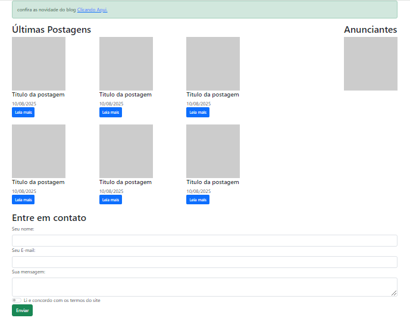

### Sobre Bootstrap

- Com bootstrap fica mais rápido para criar o front-end utiliza menas linhas de código, utilizando as classes da para ir aplicando junto ao HTML o CSS (em partes não como todo) na mesma linha de código e em poucas palavras deixando todo processo mais agil.

Clique para ver 👇

    <a href="https://ebac-modulo-bootstrap.vercel.app/">
        </img>
    </a>

